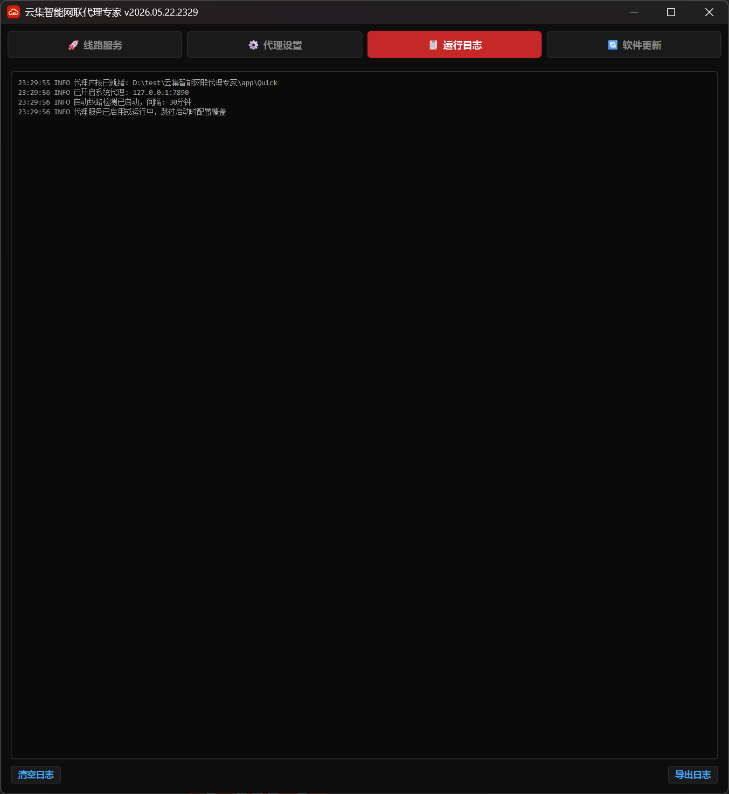

<div align="center">


# 云集智能网联代理专家

**一键智能代理 · 多线路自动切换 · 跨平台全端支持**

基于 mihomo 内核的跨平台网络代理管理工具，零配置开箱即用。

[](https://github.com/yunjii-cn/ip/releases)
[](https://gitee.com/yunjii/ip/releases)
[](LICENSE)

</div>

---

##  功能亮点

| 功能 | 说明 |
|:-----|:-----|
| 🚀 **一键启停** | 开关代理只需一键，自动配置系统代理，无需手动设置 |
| 📡 **多线路智能切换** | 4条线路并行测速，自动选择最快线路，始终保持最优连接 |
| ⏱️ **定时优化** | 定时自动检测线路质量，网络波动时自动切换 |
| 🌐 **浏览器代理** | 全局代理或指定浏览器代理（Chrome / Edge / Firefox 等） |
| 🔄 **版本管理** | 内置软件更新，多版本共存切换，硬链接映射零延迟 |
| 🌙 **深色主题** | 精心设计的暗黑界面，红色点缀，护眼且专业 |
| 📱 **跨平台支持** | Windows桌面版 + Android手机版，一套代码多端运行 |

## 📸 界面预览

### 桌面版 (Windows)

<div align="center">

</div>

### 手机版 (Android)

<div align="center">

</div>

> 📌 **提示**：上方为示意图，实际界面以软件为准。欢迎提交真实截图 PR！

## 📥 下载安装

### 下载地址

| 平台 | 链接 | 说明 |
|:-----|:-----|:-----|
| 🌍 **GitHub** | [Releases 下载](https://github.com/yunjii-cn/ip/releases) | 海外用户推荐，无空间限制，提供 EXE + APK |
| 🇨🇳 **Gitee** | [Releases 下载](https://gitee.com/yunjii/ip/releases) | 国内用户推荐，直连下载速度快 |

### Windows 桌面版安装

**方式一：在线安装（推荐）**

1. 下载 `云集智能网联代理专家-vX.X.X.exe`（约 38MB）
2. 双击运行，程序自动部署目录结构
3. 首次启动后自动下载代理内核，即可使用

**方式二：离线安装**

1. 下载 `云集智能网联代理专家-vX.X.X.zip` 整合包（约 73MB，仅 GitHub 提供）
2. 解压到任意目录
3. 双击 `云集智能网联代理专家.exe` 即可使用，无需联网下载内核

### Android 手机版安装

1. 下载 `云集智能网联代理专家_YYYYMMDD_HHMM.apk`（约 40MB）
2. 在手机上允许"未知来源应用安装"
3. 打开APK文件进行安装
4. 首次启动需要授予VPN权限，点击"允许"即可

## 📖 使用指南

### 快速上手

1. 启动软件，点击「代理服务」开关
2. 程序自动下载线路配置并启动代理内核
3. 系统代理自动配置完成，即可访问外网

### 线路管理

- **线路服务**页面：查看所有线路状态，手动测速，一键切换
- 程序自动选择延迟最低的线路
- 定时优化功能可自动保持最优连接

### 代理设置

- **全局代理**：所有网络流量通过代理
- **指定浏览器代理**：仅代理选定的浏览器（Chrome / Edge / Firefox 等）
- 支持自定义代理地址和端口

### 版本更新

- **软件更新**页面：检查远程更新，一键下载新版本
- 支持多版本共存，可随时切换回旧版本
- 版本切换采用硬链接技术，瞬间完成无需等待

## ️ 技术架构

### 整体架构图

```
┌─────────────────────────────────────────────────┐
│              Vue 3 + Vant 4 前端                 │
│         响应式布局，一套代码适配所有屏幕            │
│      手机竖屏 (9:16) ←→ 桌面宽屏 (自适应)         │
└────────────────────┬────────────────────────────┘
                     │ HTTP API + WebSocket
┌────────────────────▼────────────────────────────┐
│             FastAPI 后端 (Python)                 │
│   系统代理设置 │ 进程管理 │ 文件操作 │ 版本切换     │
────────────────────┬────────────────────────────┘
                     │
          ┌──────────┴──────────┐
          ▼                     ▼
   ┌──────────────┐     ┌──────────────┐
   │  桌面端       │     │  手机端       │
   │  pywebview    │     │  Capacitor   │
   │  窗口加载前端  │     │  APP壳加载前端│
   │  + 系统代理   │     │  + VpnService │
   │  + 本地内核   │     │  + ARM内核    │
   │  ~38MB       │     │  ~40MB       │
   └──────────────┘     └──────────────┘
```

### 技术栈详情

| 层级 | 组件 | 技术 | 说明 |
|:-----|:-----|:-----|:-----|
| **前端** | 框架 | Vue 3.5+ | 组合式 API + TypeScript |
| | UI库 | Vant 4.9+ | 移动端优先，桌面端也美观 |
| | 构建 | Vite 6.x | 极速热更新 |
| | 状态 | Pinia 3.x | Vue 3 官方推荐 |
| **后端** | 框架 | FastAPI 0.115+ | 异步、自动文档、WebSocket |
| | 服务器 | uvicorn 0.34+ | ASGI 服务器 |
| **桌面壳** | 集成 | pywebview 5.3+ | 调用系统 WebView2，~1MB |
| **手机壳** | 打包 | Capacitor 6.x | 原生 APP 打包框架 |
| | VPN | VpnService | Android 原生 VPN 隧道 |
| **代理内核** | 引擎 | mihomo (Clash Meta) | 成熟稳定的代理引擎 |
| | 模式 | TUN / HTTP | 手机TUN模式，桌面HTTP模式 |
| **打包分发** | 桌面打包 | PyInstaller 6.x | EXE 单文件打包 |
| | 手机打包 | Gradle 8.x | Android APK 构建 |
| | 分发渠道 | GitHub + Gitee | 双源冗余，全球可达 |

### 核心优势

| 特性 | 传统方案 | 云集方案 |
|:-----|:---------|:---------|
| 代码复用 | 各平台独立开发 | 一套代码，多端运行 |
| 维护成本 | N套代码 × N个团队 | 1套代码 × 1个团队 |
| 体积控制 | Electron ~150MB | pywebview ~38MB |
| 启动速度 | 慢（冷启动3-5秒） | 快（冷启动<1秒） |
| 内存占用 | 高（200-500MB） | 低（50-150MB） |

## 📋 系统要求

### Windows 桌面版

| 项目 | 要求 |
|:-----|:-----|
| 操作系统 | Windows 10 / 11 |
| 架构 | x64 |
| 磁盘空间 | 约 100MB（含代理内核） |
| 网络 | 首次启动需联网下载内核 |
| WebView2 | Windows 11自带 / Win10需安装 |

### Android 手机版

| 项目 | 要求 |
|:-----|:-----|
| 操作系统 | Android 7.0+ (API 24+) |
| 架构 | arm64-v8a |
| 磁盘空间 | 约 100MB（含APK和内核） |
| 权限 | VPN权限（首次启动时授予） |
| 通知 | Android 13+需授予通知权限 |

##  未来规划

### 短期计划 (v2026.07 - v2026.08)

- [ ] iOS/iPadOS 版本开发（Capacitor + Swift Plugin）
- [ ] macOS 版本适配（pywebview + Darwin内核）
- [ ] 鸿蒙 HarmonyOS NEXT 版本预研
- [ ] 云端配置同步功能

### 中期计划 (v2026.09 - v2026.12)

- [ ] 插件系统开发（第三方扩展支持）
- [ ] 规则编辑器可视化
- [ ] 流量统计图表化
- [ ] 多语言国际化（英文/日文/韩文）

### 长期愿景

- [ ] 成为跨平台代理管理的事实标准
- [ ] 建立完善的开发者生态
- [ ] 支持更多代理协议（WireGuard、ShadowsocksR等）
- [ ] 企业级集中管理功能

## ⚖️ 开源协议

本项目基于 [GPL-3.0](LICENSE) 协议开源。

| 权限 | 说明 |
|:-----|:-----|
| ✅ 自由使用 | 个人和商业用途均可 |
| ✅ 修改和分发 | 允许修改源码并重新分发 |
| ✅ 学习参考 | 可作为学习项目参考 |
| ❌ 闭源商业 | 衍生作品必须同样以 GPL-3.0 开源 |
|  移除版权 | 禁止移除版权声明和协议声明 |

## 🤝 贡献指南

欢迎提交 Issue 和 Pull Request！

- **Bug 反馈**：请提供详细的复现步骤和日志信息
- **功能建议**：请说明使用场景和期望效果
- **代码贡献**：请遵循现有代码风格，添加必要的测试

##  相关文档

- [架构说明](docs/架构说明.md) - 详细的技术架构和数据流
- [开发指南](docs/开发指南.md) - 本地开发和构建说明
- [Web化改造规划](docs/Web化改造规划.md) - 从PyQt6到Web架构的迁移过程
- [Capacitor手机端打包规划](docs/Capacitor手机端打包规划.md) - 移动端实施步骤

---

<div align="center">

**Copyright © 2026 云集智能 (yunjii). All rights reserved.**

[官网](https://yunjii.cn) · [GitHub](https://github.com/yunjii-cn/ip) · [Gitee](https://gitee.com/yunjii/ip) · [问题反馈](https://github.com/yunjii-cn/ip/issues)

</div>
