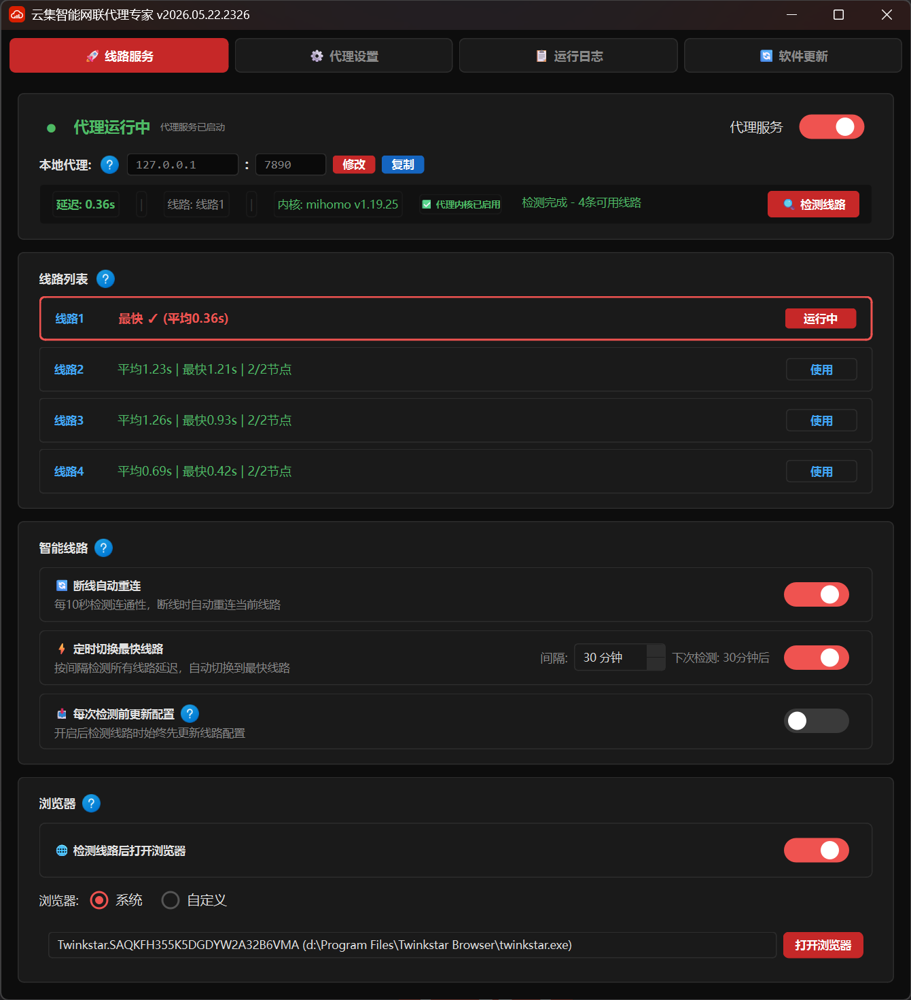
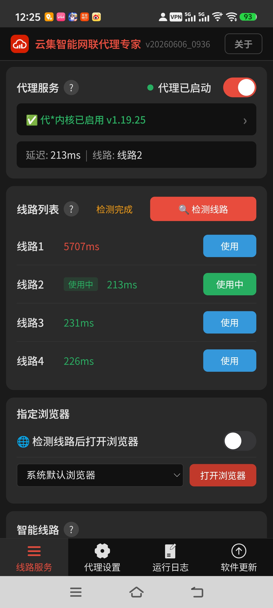
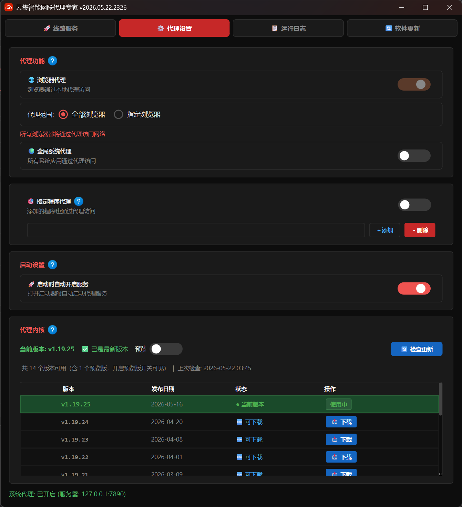
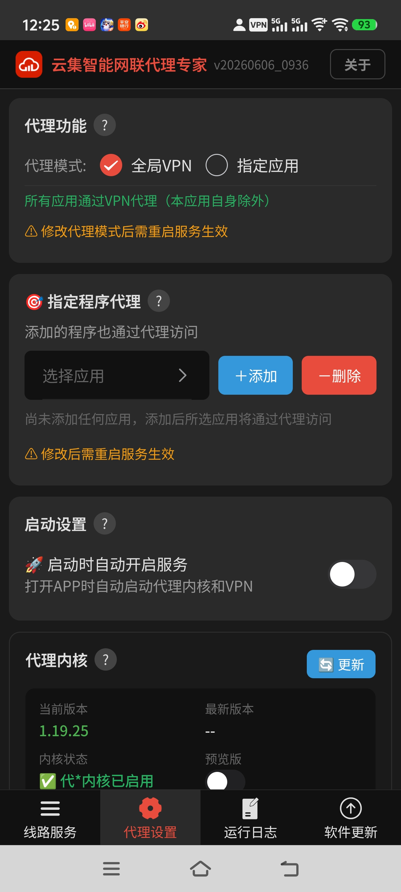
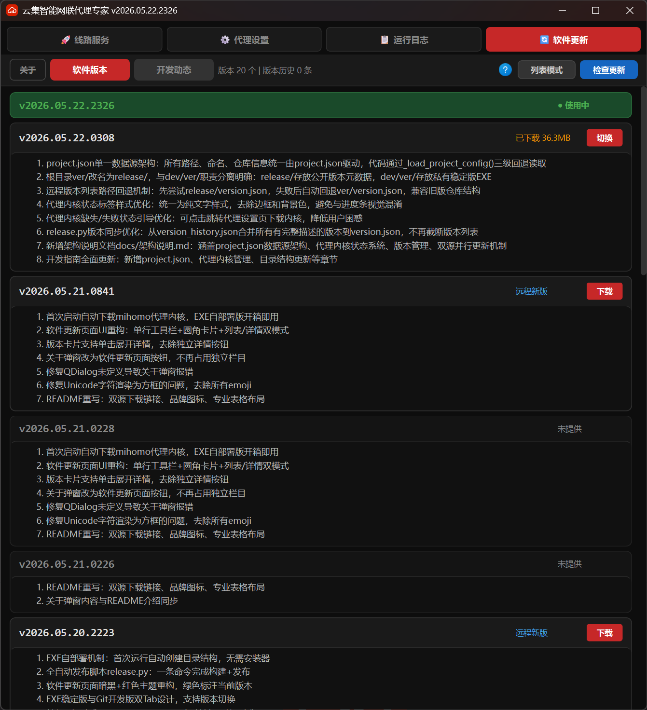
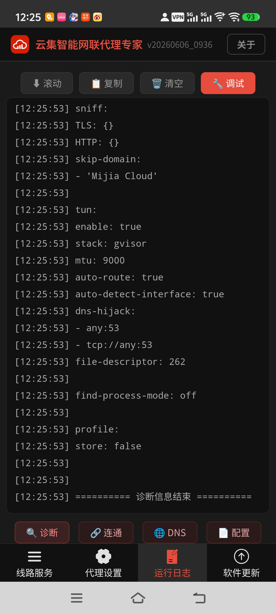

<div align="center">


# 云集智能网联代理专家

**一键智能代理 · 多线路自动切换 · 跨平台全端支持**

基于 mihomo 内核的跨平台网络代理管理工具，零配置开箱即用。

[](https://github.com/yunjii-cn/ip/releases)
[](https://gitee.com/yunjii/ip/releases)
[](LICENSE)

</div>

---

## 📸 界面预览

<table>
<tr>
<td align="center" width="50%">
<b>🖥️ Windows 桌面版</b>
</td>
<td align="center" width="50%">
<b>📱 Android 手机版</b>
</td>
</tr>
<tr>
<td align="center">

<br><sub>代理控制面板</sub>
</td>
<td align="center">

<br><sub>首页概览</sub>
</td>
</tr>
<tr>
<td align="center">

<br><sub>线路管理与测速</sub>
</td>
<td align="center">

<br><sub>线路检测与切换</sub>
</td>
</tr>
<tr>
<td align="center">

<br><sub>版本管理与更新</sub>
</td>
<td align="center">

<br><sub>代理设置</sub>
</td>
</tr>
</table>

---

## ✨ 功能亮点

| 功能 | 说明 |
|:-----|:-----|
| 🚀 **一键启停** | 开关代理只需一键，自动配置系统代理，无需手动设置 |
| 📡 **多线路智能切换** | 4条线路并行测速，自动选择最快线路，始终保持最优连接 |
| ⏱️ **定时优化** | 定时自动检测线路质量，网络波动时自动切换 |
| 🌐 **浏览器代理** | 全局代理或指定浏览器代理（Chrome / Edge / Firefox 等） |
| 🔄 **版本管理** | 内置软件更新，多版本共存切换，硬链接映射零延迟 |
| 🌙 **深色主题** | 精心设计的暗黑界面，红色点缀，护眼且专业 |
| 📱 **跨平台支持** | Windows桌面版 + Android手机版，一套代码多端运行 |

---

## 📥 下载安装

| 平台 | 链接 | 说明 |
|:-----|:-----|:-----|
| 🌍 **GitHub** | [Releases 下载](https://github.com/yunjii-cn/ip/releases) | 海外用户推荐，无空间限制，提供 EXE + APK |
| 🇨🇳 **Gitee** | [Releases 下载](https://gitee.com/yunjii/ip/releases) | 国内用户推荐，直连下载速度快 |

### Windows 桌面版

**方式一：在线安装（推荐）**

1. 下载 `云集智能网联代理专家-vX.X.X.exe`（约 38MB）
2. 双击运行，程序自动部署目录结构
3. 首次启动后自动下载代理内核，即可使用

**方式二：离线安装**

1. 下载 `云集智能网联代理专家-vX.X.X.zip` 整合包（约 73MB，仅 GitHub 提供）
2. 解压到任意目录
3. 双击 `云集智能网联代理专家.exe` 即可使用，无需联网下载内核

### Android 手机版

1. 下载 `云集智能网联代理专家_YYYYMMDD_HHMM.apk`（约 40MB）
2. 在手机上允许"未知来源应用安装"
3. 打开APK文件进行安装
4. 首次启动需要授予VPN权限，点击"允许"即可

---

## 📖 使用指南

### 快速上手

1. 启动软件，点击「代理服务」开关
2. 程序自动下载线路配置并启动代理内核
3. 系统代理自动配置完成，即可访问外网

### 线路管理

- **线路服务**页面：查看所有线路状态，手动测速，一键切换
- 程序自动选择延迟最低的线路
- 定时优化功能可自动保持最优连接

### 代理设置

- **全局代理**：所有网络流量通过代理
- **指定浏览器代理**：仅代理选定的浏览器（Chrome / Edge / Firefox 等）
- 支持自定义代理地址和端口

### 版本更新

- **软件更新**页面：检查远程更新，一键下载新版本
- 支持多版本共存，可随时切换回旧版本
- 版本切换采用硬链接技术，瞬间完成无需等待

---

## 🏗️ 技术架构

```
┌─────────────────────────────────────────────────┐
│              Vue 3 + Vant 4 前端                 │
│         响应式布局，一套代码适配所有屏幕            │
│      手机竖屏 (9:16) ←→ 桌面宽屏 (自适应)         │
└────────────────────┬────────────────────────────┘
                     │ HTTP API + WebSocket
┌────────────────────▼────────────────────────────┐
│             FastAPI 后端 (Python)                 │
│   系统代理设置 │ 进程管理 │ 文件操作 │ 版本切换     │
└────────────────────┬────────────────────────────┘
                     │
          ┌──────────┴──────────┐
          ▼                     ▼
   ┌──────────────┐     ┌──────────────┐
   │  桌面端       │     │  手机端       │
   │  pywebview    │     │  Capacitor   │
   │  窗口加载前端  │     │  APP壳加载前端│
   │  + 系统代理   │     │  + VpnService │
   │  + 本地内核   │     │  + ARM内核    │
   │  ~38MB       │     │  ~40MB       │
   └──────────────┘     └──────────────┘
```

### 技术栈

| 层级 | 技术 | 说明 |
|:-----|:-----|:-----|
| **前端** | Vue 3.5+ / Vant 4.9+ / Vite 6.x | 组合式 API + 移动端优先 UI |
| **后端** | FastAPI 0.115+ / uvicorn | 异步 API + WebSocket |
| **桌面壳** | pywebview 5.3+ | 调用系统 WebView2，~1MB |
| **手机壳** | Capacitor 6.x + VpnService | 原生 APP + VPN 隧道 |
| **代理内核** | mihomo (Clash Meta) | 成熟稳定的代理引擎 |
| **打包分发** | PyInstaller / Gradle / GitHub + Gitee | 双源冗余，全球可达 |

### 核心优势

| 特性 | 传统方案 | 云集方案 |
|:-----|:---------|:---------|
| 代码复用 | 各平台独立开发 | 一套代码，多端运行 |
| 体积控制 | Electron ~150MB | pywebview ~38MB |
| 启动速度 | 冷启动 3-5 秒 | 冷启动 <1 秒 |
| 内存占用 | 200-500MB | 50-150MB |

---

## 📋 系统要求

| 平台 | 要求 |
|:-----|:-----|
| **Windows** | Windows 10/11 x64，约 100MB 磁盘空间，首次需联网下载内核 |
| **Android** | Android 7.0+ (arm64-v8a)，约 100MB 磁盘空间，需授予 VPN 权限 |

---

## 🗺️ 未来规划

- [ ] iOS/iPadOS 版本（Capacitor + Swift Plugin）
- [ ] macOS 版本适配（pywebview + Darwin 内核）
- [ ] 鸿蒙 HarmonyOS NEXT 版本预研
- [ ] 云端配置同步功能
- [ ] 插件系统（第三方扩展支持）
- [ ] 规则编辑器可视化
- [ ] 流量统计图表化
- [ ] 多语言国际化（英文/日文/韩文）

---

## ⚖️ 开源协议

本项目基于 [GPL-3.0](LICENSE) 协议开源。

| ✅ 允许 | ❌ 禁止 |
|:--------|:--------|
| 个人和商业用途 | 闭源商业分发 |
| 修改源码并重新分发 | 移除版权声明 |
| 作为学习项目参考 | 不遵守 GPL-3.0 协议 |

---

## 🤝 贡献指南

欢迎提交 Issue 和 Pull Request！

- **Bug 反馈**：请提供详细的复现步骤和日志信息
- **功能建议**：请说明使用场景和期望效果
- **代码贡献**：请遵循现有代码风格，添加必要的测试

---

<div align="center">

**Copyright © 2026 云集智能 (yunjii). All rights reserved.**

[官网](https://yunjii.cn) · [GitHub](https://github.com/yunjii-cn/ip) · [Gitee](https://gitee.com/yunjii/ip) · [问题反馈](https://github.com/yunjii-cn/ip/issues)

</div>
